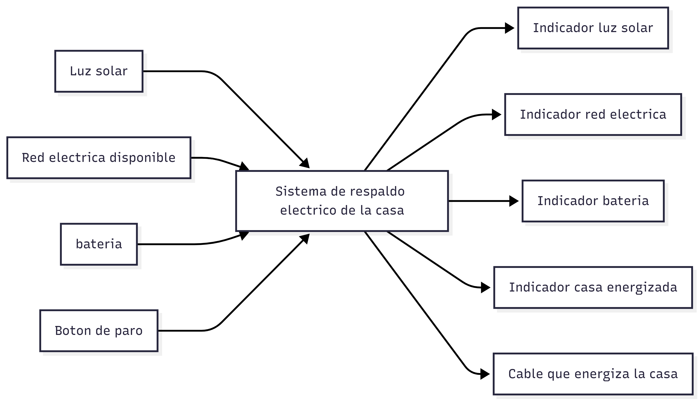
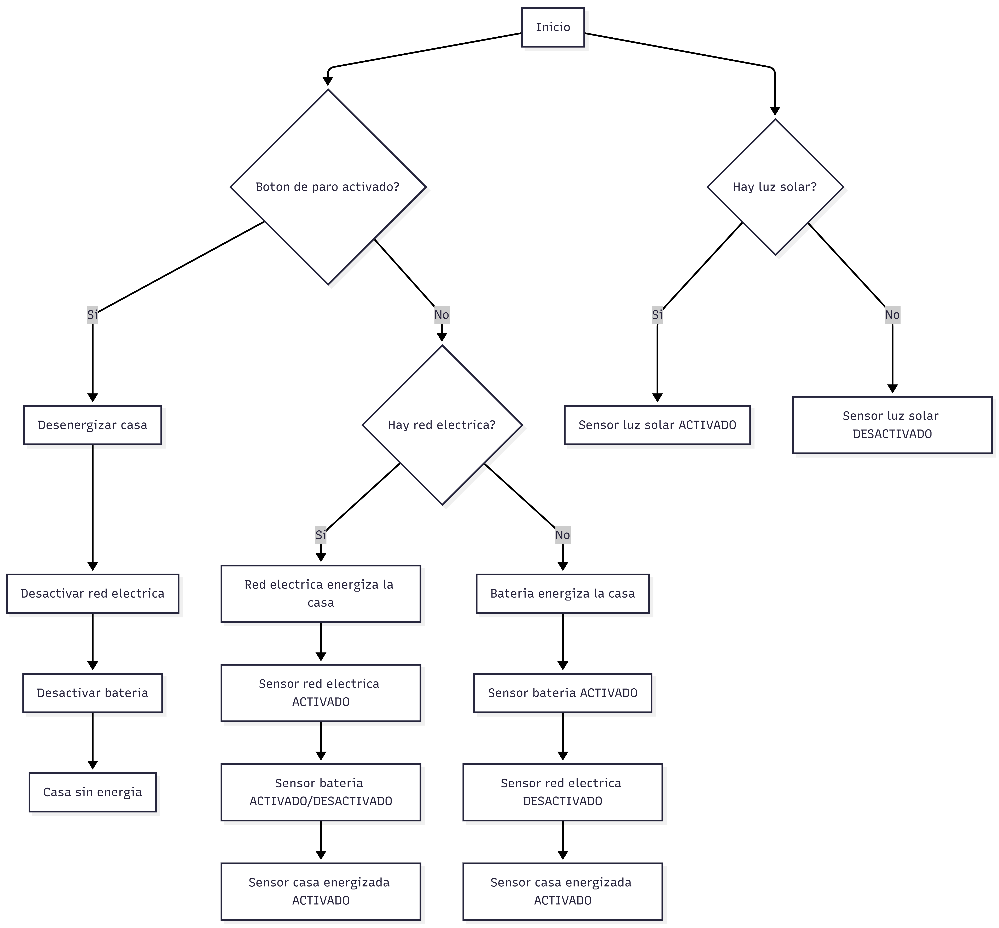
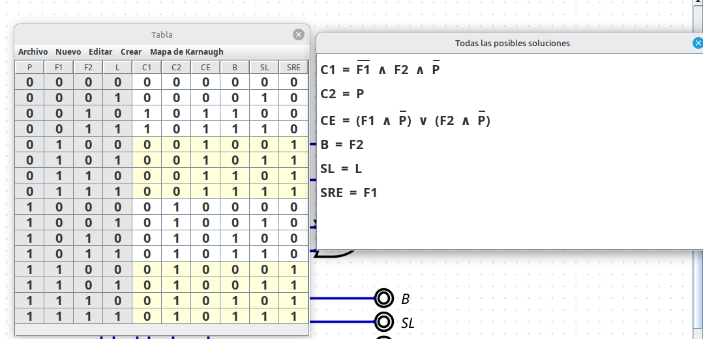
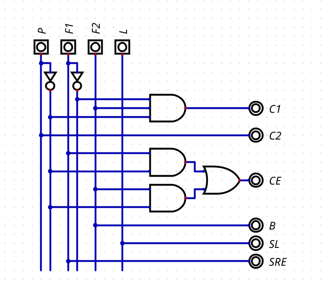
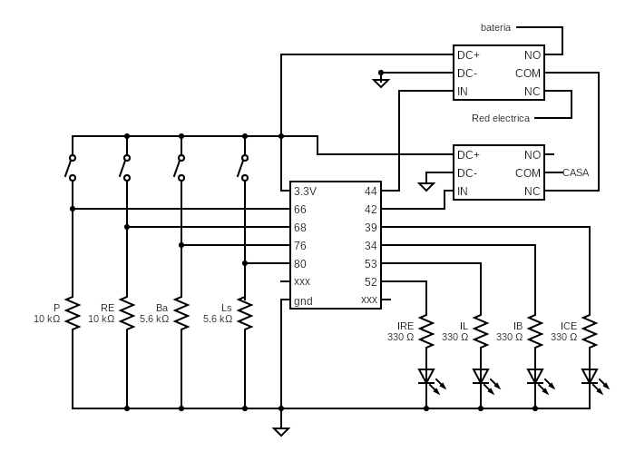

# Sistema de Respaldo Eléctrico Residencial 

Este repositorio contiene la documentación técnica, el diseño y la solución del laboratorio **My First Design**. El proyecto consiste en el diseño de un Sistema Lógico de Respaldo Eléctrico que gestiona de manera automática la prioridad de alimentación entre la red eléctrica convencional y un banco de baterías, incorporando medidas de seguridad críticas mediante un botón de paro de emergencia.

El proyecto está estructurado bajo tres dominios fundamentales del diseño electrónico: **Comportamental**, **Estructural** y **Físico**.

---

## 1. Dominio Comportamental

Este dominio define *qué* hace el sistema, sus interfaces y su lógica de control algorítmica, sin entrar en detalles de la implementación del hardware interno.

### Diagrama de Caja Negra

Establece las fronteras del sistema, definiendo claramente las señales de entrada (estímulos y sensores) y las señales de salida (actuadores e indicadores visuales).

* **Entradas:** Luz solar, Disponibilidad de red eléctrica, Batería, Botón de paro.

* **Salidas:** Indicadores lógicos para cada estado (luz solar, red, batería, casa energizada) y la salida física principal (cable que energiza la casa).

### Diagrama de Flujo

Describe el algoritmo de toma de decisiones y las prioridades del sistema:

1.  **Prioridad 1 (Seguridad):** El botón de paro tiene prioridad absoluta. Si se activa, desenergiza inmediatamente la casa y desactiva todas las fuentes.

2.  **Prioridad 2 (Red Principal):** Si no hay paro y la red eléctrica está disponible, esta asume la carga de la casa.

3.  **Prioridad 3 (Respaldo):** Si la red eléctrica falla, el sistema conmuta automáticamente a la batería.

*Nota: El sensor de luz solar opera de manera independiente para propósitos de indicación.*

### Tabla de Verdad y Ecuaciones Booleanas

Define la lógica combinacional exacta que rige el sistema. A partir del mapa de Karnaugh, se obtuvieron las siguientes ecuaciones booleanas simplificadas que dictan el comportamiento de las salidas en función de las entradas ($P$, $F1$, $F2$, $L$):

* $C1 = \overline{F1} \land F2 \land \overline{P}$

* $C2 = P$

* $CE = (F1 \land \overline{P}) \lor (F2 \land \overline{P})$

* $B = F2$

* $SL = L$

* $SRE = F1$

## Diccionario de Señales (Entradas / Salidas)

| Tipo | Variable Lógica | Etiqueta Física | Descripción |

| :--- | :---: | :---: | :--- |

| **Entrada** | $P$ | `P` | Botón de Paro (Emergencia) |

| **Entrada** | $F1$ | `RE` | Sensor / Disponibilidad de Red Eléctrica |

| **Entrada** | $F2$ | `Ba` | Sensor / Disponibilidad de Batería |

| **Entrada** | $L$ | `Ls` | Sensor de Luz Solar |

| **Salida** | $CE$ | `ICE` | Indicador de Casa Energizada (Lógica / LED) |

| **Salida** | $C1$ / $C2$ | `IN` (Relés) | Señales de control hacia los módulos de relé |

| **Salida** | $SRE$ | `IRE` | Indicador LED de Red Eléctrica |

| **Salida** | $B$ | `IB` | Indicador LED de Batería |

| **Salida** | $SL$ | `IL` | Indicador LED de Luz Solar |

---

## 2. Dominio Estructural

Este dominio detalla *cómo* está construida la lógica interna mediante la interconexión de bloques y compuertas lógicas digitales puras.

### Diagrama de Compuertas

Esquemático que implementa las ecuaciones booleanas obtenidas en el dominio comportamental utilizando lógica digital estándar. 

* **Inversores (NOT):** Utilizados para negar las señales de Paro ($P$) y Red Eléctrica ($F1$).

* **Compuertas AND:** Configurada para evaluar las condiciones simultáneas (ej. batería activa Y red caída Y sin paro).

* **Compuertas OR:** Utilizada para la señal de Casa Energizada ($CE$), permitiendo que la energía fluya ya sea por la red o por la batería.

* **Líneas directas:** Las señales de los indicadores visuales ($B$, $SL$, $SRE$) fluyen directamente desde las entradas a las salidas correspondientes.

---

## 3. Dominio Físico

Este dominio abarca la materialización del circuito, considerando componentes electrónicos reales, niveles de voltaje (3.3V) y etapas de aislamiento y potencia.

### Circuito Físico

Implementación del esquemático electrónico dividida en cuatro etapas principales:

1.  **Etapa de Entrada:** Interruptores (switches) configurados con resistencias de *pull-down* (10 kΩ y 5.6 kΩ) para garantizar niveles lógicos estables en los pines de entrada.

2.  **Etapa de Procesamiento:** Unidad central (IC) que procesa las señales lógicas.

3.  **Etapa de Indicación:** Arreglo de LEDs con resistencias limitadoras de corriente (330 Ω) para proveer retroalimentación visual del estado del sistema (IRE, IL, IB, ICE).

4.  **Etapa de Potencia/Conmutación:** Uso de módulos de relés electromecánicos. El sistema lógico controla los relés para enrutar físicamente la energía (Red eléctrica o Batería) hacia la carga final (Casa), asegurando aislamiento galvánico entre la lógica de 3.3V y el voltaje de potencia.

---

/*
